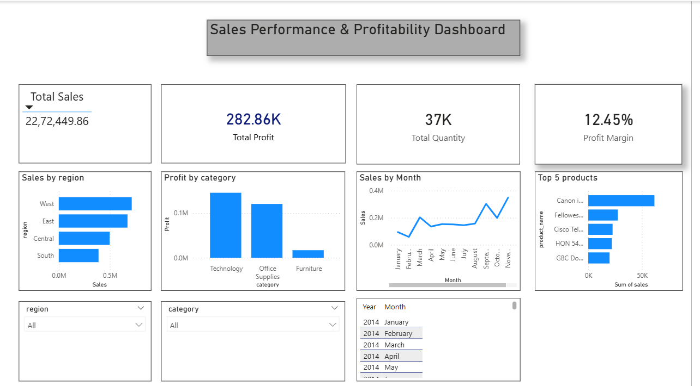

Sales Performance Dashboard using Power BI and SQL

# Sales Performance & Profitability Dashboard

This project analyzes sales performance using Power BI and SQL.

## 🔹 Features
- KPI Cards (Total Sales, Profit, Quantity, Profit Margin)
- Sales by Region analysis
- Profit by Category visualization
- Top 5 Products identification
- Monthly Sales Trend analysis
- Interactive slicers (Region, Category, Date)

## 🔹 Tools Used
- Power BI
- SQL (MySQL)

## 🔹 Dashboard Preview

